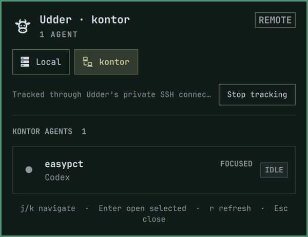

# Udder

Udder adds a small cow to the Omarchy bar that shows every coding agent in your
local [Herdr](https://herdr.dev) session. Open it to see who is working, idle,
blocked, or finished. Click any agent and Udder takes you to that exact
conversation in the Herdr terminal you already had open.

It was made for the time between sending several agents to work and coming
back for their answers. You can leave Herdr, get on with something else, and
still know when an agent finishes. Udder sends a desktop notification with
Herdr's familiar completion sound; clicking it returns you to the finished
agent on the right desktop.

When Herdr is already in front of you, Udder stays out of the way. It is not a
second Herdr; it is the small glance-and-return loop that makes leaving Herdr
feel safe.



## Everyday use

- Click the cow to see who is working, idle, blocked, or finished.
- Click an agent to jump to that exact agent in your local Herdr terminal.
- If local Herdr is already open elsewhere, Udder takes you to its desktop
  instead of opening another terminal.
- Remote Herdr sessions stay separate, so a local agent never sends you to an
  SSH client by mistake.
- If you are away from Herdr when work finishes, Udder gives you one useful
  notification and Herdr's completion chime.

## Install

```bash
omarchy plugin add https://github.com/stappmus/Udder.git --enable
```

On first load, Udder registers its event bridge with Herdr. That bridge is the
same audited checkout and contains no resident process. If you prefer to manage
the bridge yourself, disable **Register Herdr event bridge** in the widget
settings and link it manually:

```bash
herdr plugin link ~/.config/omarchy/plugins/stappmus.udder --enabled
```

Requirements:

- Omarchy Quattro with its current Quickshell plugin API and Hyprland.
- Herdr 0.7.0 or newer.
- `jq`, `flock`, `pgrep`, and `timeout`, all included in a normal Omarchy
  installation.
- For the optional completion chime: `pw-play`, `paplay`, `ffplay`, `mpg123`,
  or `mpv`. Udder quietly skips sound if none is available.

## Controls

- Left click: open the overview, or open Herdr when finished work is pending.
- Middle click: return to the local Herdr terminal, or open one if needed.
- Right click: refresh the cached overview.
- Panel: click an agent row—or select it with `j`/`k` or arrows and press
  Enter—to focus that exact pane, then move to the desktop containing the local
  Herdr terminal. Remote (`herdr --remote ...`) and named-session clients are
  deliberately kept separate. `r` refreshes and Esc closes.

## Resource use

Udder does not poll Herdr in the background. Herdr launches the tiny
`udder-event` hook only when an agent lifecycle event occurs. The overview asks
for one socket snapshot when opened, then refreshes only while visible.

The only idle check is a direct read of `/proc/net/unix` every five seconds to
notice a newly attached client and clear stale alerts. It launches no process,
uses no network, and can be relaxed to 60 seconds in the widget settings.
The completion sound launches an audio player only for the 1.08-second chime
when Udder posts a notification, and can be disabled in the widget settings.

## Remove

Unlink the companion before removing the Omarchy checkout:

```bash
~/.config/omarchy/plugins/stappmus.udder/udder-integrate --unlink
omarchy plugin remove stappmus.udder
```

Udder stores pending completion state in
`~/.local/state/omarchy/udder.json`.
You may remove that file and `udder-integration.lock` after uninstalling; no
other Udder process or service remains installed.

Udder's source is MIT licensed. Its unmodified Herdr completion sound is
Apache-2.0 licensed; see [`THIRD_PARTY_NOTICES.md`](THIRD_PARTY_NOTICES.md).

## Development

```bash
omarchy plugin validate .
./tests/run.sh
```
