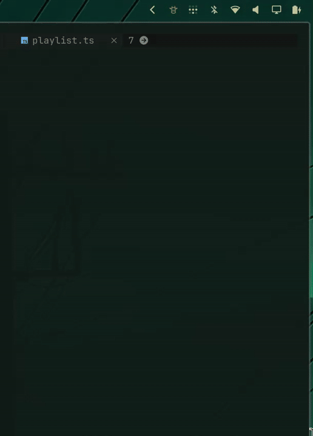

# Udder

Udder adds a small cow to the Omarchy bar that shows every coding agent in your
local [Herdr](https://herdr.dev) session and any remote sessions you approve.
Open it to see who is working, idle, blocked, or finished. Click any local agent
to return to that exact conversation, or a remote agent to return to its remote
Herdr dashboard.

It was made for the time between sending several agents to work and coming
back for their answers. You can leave Herdr, get on with something else, and
still know when an agent finishes. Udder sends a desktop notification with
Herdr's familiar completion sound; clicking it returns you to the finished
agent on the right desktop.

When Herdr is already in front of you, Udder stays out of the way. It is not a
second Herdr; it is the small glance-and-return loop that makes leaving Herdr
feel safe.




## Everyday use

- Click the cow to see who is working, idle, blocked, or finished.
- Click an agent to jump to that exact agent in your local Herdr terminal.
- If local Herdr is already open elsewhere, Udder takes you to its desktop
  instead of opening another terminal.
- When `herdr --remote <ssh-target>` connects, Udder asks whether to track it.
  Approved remotes get their own session tab and stay separate from local work.
- If you are away from Herdr when work finishes, Udder gives you one useful
  notification and Herdr's completion chime.

## Install

```bash
omarchy plugin add https://github.com/stappmus/Udder.git --enable
```

On first load, Udder registers its event bridge with Herdr. That bridge is the
same audited checkout and contains no resident process. If you prefer to manage
the bridge yourself, disable **Register Herdr event bridge** in the widget
settings and link it manually:

```bash
herdr plugin link ~/.config/omarchy/plugins/stappmus.udder --enabled
```

Requirements:

- Omarchy Quattro with its current Quickshell plugin API and Hyprland.
- Herdr 0.7.0 or newer.
- `jq`, `flock`, `pgrep`, `sha256sum`, and `timeout`, all included in a normal Omarchy
  installation.
- OpenSSH for optional remote tracking, already required by `herdr --remote`.
- For the optional completion chime: `pw-play`, `paplay`, `ffplay`, `mpg123`,
  or `mpv`. Udder quietly skips sound if none is available.

## Remote sessions

Want to keep an eye on Herdr running on another computer? Connect to it once
through Herdr's normal SSH support:

```bash
herdr --remote my-server
```

Then open Udder from the cow in your bar and press **Track** when it asks about
the new remote. That's it—the remote gets its own tab beside **Local**, with the
same working, blocked, idle, and done overview. You can close the terminal you
used to connect; Udder keeps tracking the remote in the background and opens a
new remote Herdr terminal when you select one of its agents. This also works
when the remote command is wrapped in a friendly alias or shell function such
as `work-herdr`.

Udder never tracks a remote without asking. It remembers approved SSH targets
and named Herdr sessions, uses your normal SSH configuration, and never stores
SSH credentials. For a passphrase-protected key, load it into `ssh-agent` first
with `ssh-add` so Udder can reconnect without an interactive terminal. Choose
**Not now** to ignore a connection for the moment, or **Stop tracking** later to
close Udder's SSH connection and remove the remembered choice.

Remote agent rows return to the matching remote Herdr window. Exact pane focus
is currently local-only because Herdr's public remote CLI does not expose an
arbitrary-pane focus command.

## Controls

- Left click: open the overview, or open Herdr when finished work is pending.
- Middle click: return to the local Herdr terminal, or open one if needed.
- Right click: refresh the cached overview.
- Panel: choose **Local** or an approved remote tab. Click an agent row—or select
  it with `j`/`k` or arrows and press Enter—to return to the matching Herdr
  dashboard. Local rows focus the exact pane. `r` refreshes the selected session
  and Esc closes.

## Resource use

Udder does not poll the local Herdr server in the background. Herdr launches the
tiny `udder-event` hook only when a local agent lifecycle event occurs. The
overview asks for one local socket snapshot when opened, then refreshes only
while visible.

The only idle check is a direct read of `/proc/net/unix` every five seconds to
notice a newly attached client and clear stale alerts. It launches no process,
uses no network, and can be relaxed to 60 seconds in the widget settings.
Approved remote sessions are the exception: Udder keeps a private multiplexed
SSH connection and requests a read-only snapshot every ten seconds by default,
even after the original `herdr --remote` terminal closes. If the connection is
lost, the next refresh reconnects through your normal SSH configuration. This
interval can be set from 5 to 60 seconds or stopped entirely with **Stop
tracking**.
The completion sound launches an audio player only for the 1.08-second chime
when Udder posts a notification, and can be disabled in the widget settings.

## Remove

Unlink the companion before removing the Omarchy checkout:

```bash
~/.config/omarchy/plugins/stappmus.udder/udder-integrate --unlink
omarchy plugin remove stappmus.udder
```

Udder stores pending local completion state and approved remote-session choices
in `~/.local/state/omarchy/udder.json`.
You may remove that file and `udder-integration.lock` after uninstalling; no
other Udder process or service remains installed.

Udder's source is MIT licensed. Its unmodified Herdr completion sound is
Apache-2.0 licensed; see [`THIRD_PARTY_NOTICES.md`](THIRD_PARTY_NOTICES.md).

## Development

```bash
omarchy plugin validate .
./tests/run.sh
```
