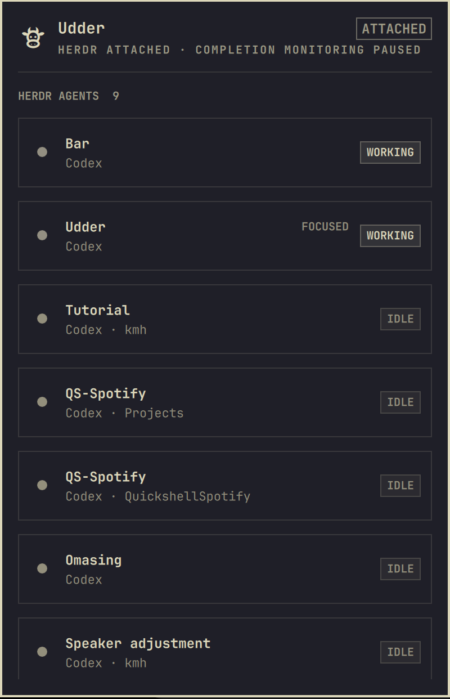

# Udder

Udder was made for the moment when you have several agents working in
[Herdr](https://herdr.dev), but you do not want to spend the next ten minutes
staring at a terminal.

The little cow in your Omarchy bar gives you a quiet place to check on the
whole herd. Open it when you are curious, then go back to whatever else you
were doing. If an agent finishes while Herdr is out of sight, Udder lets you
know with the familiar Herdr sound. Click the agent and you are taken straight
back to that conversation—on the right desktop, in the Herdr terminal you
already had open.

When Herdr is already in front of you, Udder stays out of the way. It is not a
second Herdr; it is the small glance-and-return loop that makes leaving Herdr
feel safe.



## Everyday use

- Click the cow to see who is working, idle, blocked, or finished.
- Click an agent to jump to that exact agent in your local Herdr terminal.
- If local Herdr is already open elsewhere, Udder takes you to its desktop
  instead of opening another terminal.
- Remote Herdr sessions stay separate, so a local agent never sends you to an
  SSH client by mistake.
- If you are away from Herdr when work finishes, Udder gives you one useful
  notification and Herdr's completion chime.

## Install

```bash
omarchy plugin add https://github.com/stappmus/Udder.git --enable
```

On first load, Udder registers its event bridge with Herdr. That bridge is the
same audited checkout and contains no resident process. If you prefer to manage
the bridge yourself, disable **Register Herdr event bridge** in the widget
settings and link it manually:

```bash
herdr plugin link ~/.config/omarchy/plugins/stappmus.udder --enabled
```

Requirements: Linux, the current Omarchy shell plugin API, Herdr 0.7.0 or
newer, and `jq`/`flock` (both part of a normal Omarchy installation).

## Controls

- Left click: open the overview, or open Herdr when finished work is pending.
- Middle click: return to the local Herdr terminal, or open one if needed.
- Right click: refresh the cached overview.
- Panel: click an agent row—or select it with `j`/`k` or arrows and press
  Enter—to focus that exact pane, then move to the desktop containing the local
  Herdr terminal. Remote (`herdr --remote ...`) and named-session clients are
  deliberately kept separate. `r` refreshes and Esc closes.

## Resource use

Udder does not poll Herdr in the background. Herdr launches the tiny
`udder-event` hook only when an agent lifecycle event occurs. The overview asks
for one socket snapshot when opened, then refreshes only while visible.

The only idle check is a direct read of `/proc/net/unix` every five seconds to
notice a newly attached client and clear stale alerts. It launches no process,
uses no network, and can be relaxed to 60 seconds in the widget settings.
The completion sound launches an audio player only for the 1.08-second chime
when Udder posts a notification, and can be disabled in the widget settings.

## Remove

Unlink the companion before removing the Omarchy checkout:

```bash
~/.config/omarchy/plugins/stappmus.udder/udder-integrate --unlink
omarchy plugin remove stappmus.udder
```

Udder stores pending completion state in
`~/.local/state/omarchy/udder.json`.

Udder's source is MIT licensed. Its unmodified Herdr completion sound is
Apache-2.0 licensed; see [`THIRD_PARTY_NOTICES.md`](THIRD_PARTY_NOTICES.md).

## Development

```bash
omarchy plugin validate .
./tests/run.sh
```
